# MathDefy

MathDefy is an educational app that transforms math practice into structured, engaging, and measurable progress.

Designed for learners, families, and educators, the app makes it possible to create personalized math challenges, practice them through activities and games, and track progress with clear analytics.

> This public repository is a **project showcase**.  
> It presents the product, visuals, and main features without exposing the private source code.

## Build. Play. Improve.

MathDefy helps users move from repetition to real progression through a simple loop:

- build a custom challenge
- practice with activities and game modes
- review progress and mistakes
- improve step by step with analytics and reinforcement

## Why MathDefy?

- Create challenges your way
- Practice through activities, games, and levels
- Track mistakes and progress
- Improve step by step with smart insights

## Core Features

### Challenge Builder

- Create challenges using addition, subtraction, multiplication, and division
- Select number ranges and pedagogical variants
- Reuse the same challenge across multiple activity and game formats

### Activities

- Find the result - Choice
- Find the result - Writing
- True or false
- Flashcards
- Time race
- Find the missing operand
- Find the operator
- Find the operation
- Matching
- Complete the operations

### Games

- Memory game
- Tic-tac-toe
- Board journey
- Connect 4
- Head-to-head duel
- Snake game
- Number invasion

### Analytics

- Overall progress
- Activity analytics
- Mistake analytics
- Reinforcement based on learner errors
- Speed evaluation through timed practice

### User Experience

- Guided first-launch onboarding
- Mobile-first interface
- Multilingual support
- Challenge-centered navigation

## Screenshots

Place your images in:

```text
docs/
  screenshots/
```

Suggested file names:

```text
docs/screenshots/home-challenges.png
docs/screenshots/challenge-builder-empty.png
docs/screenshots/challenge-builder-filled.png
docs/screenshots/challenge-activities.png
docs/screenshots/challenge-games.png
docs/screenshots/activity-levels.png
docs/screenshots/analytics-overview.png
docs/screenshots/analytics-activities.png
docs/screenshots/analytics-mistakes.png
docs/screenshots/find-result-choice.png
docs/screenshots/complete-operations.png
docs/screenshots/memory-game.png
docs/screenshots/snake-game.png
docs/screenshots/number-invasion.png
docs/screenshots/tic-tac-toe-settings.png
docs/screenshots/settings.png
```

### Main Screens

| Home | Challenge Builder |
|---|---|
| 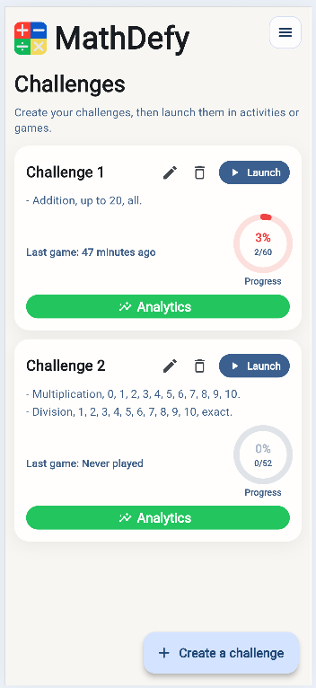 | 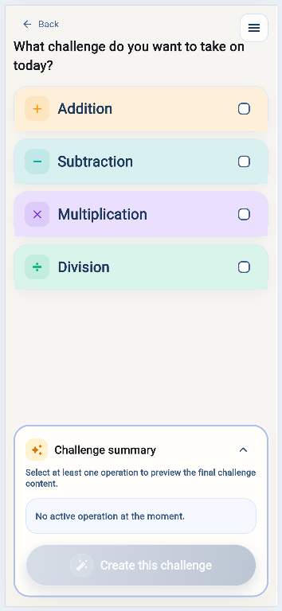 |

| Challenge Builder Configured | Activities |
|---|---|
| 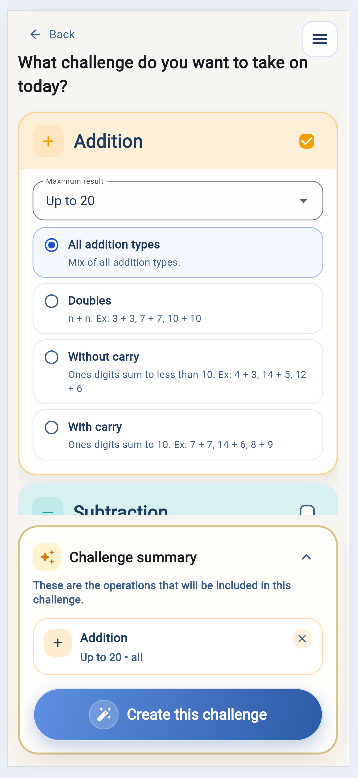 | 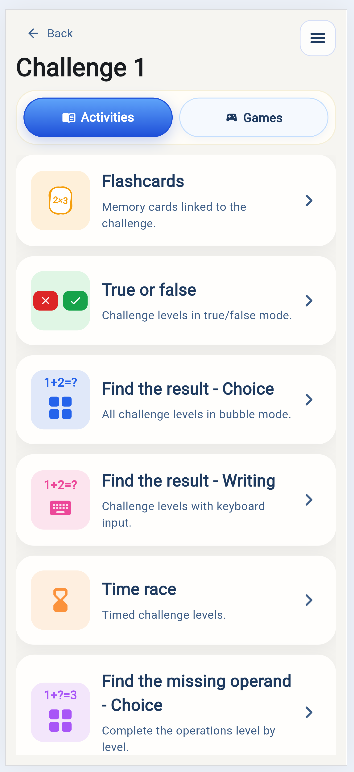 |

| Games | Activity Levels |
|---|---|
| 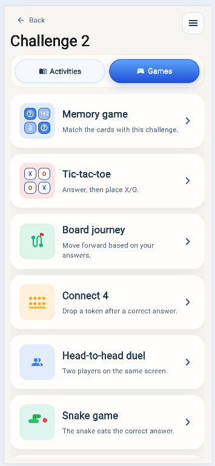 | 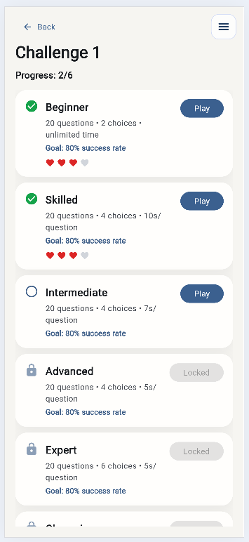 |

### Analytics

| Overview Analytics | Activity Analytics | Mistake Analytics |
|---|---|---|
| 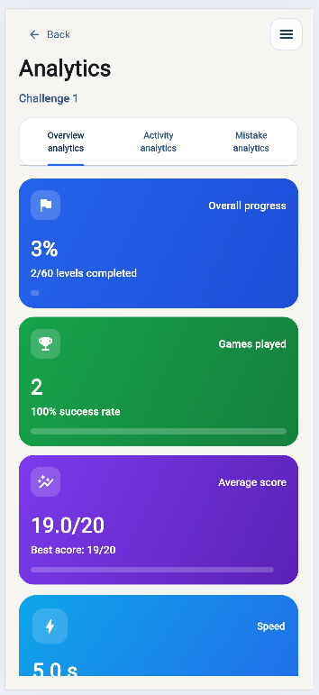 | 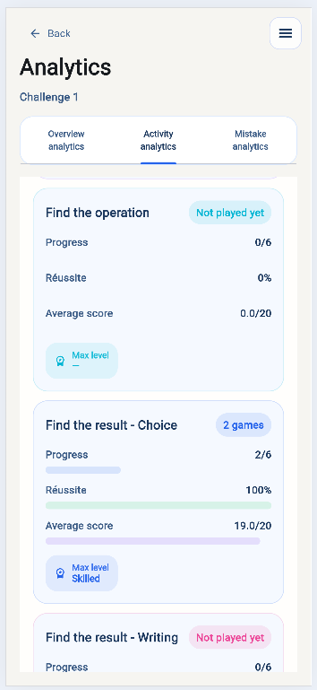 | 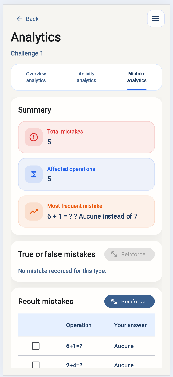 |

### Practice and Games

| Find the Result - Choice | Complete Operations | Memory Game |
|---|---|---|
| 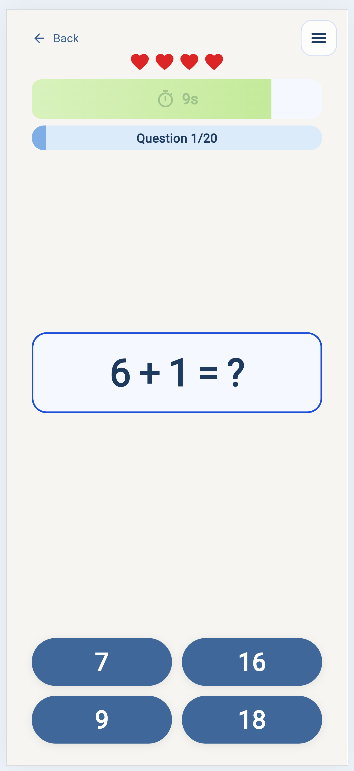 | 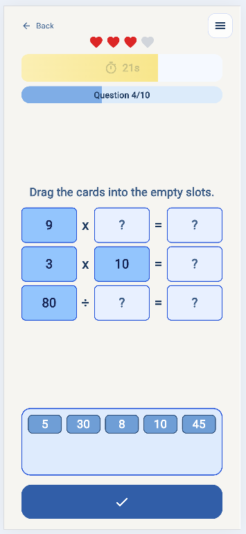 | 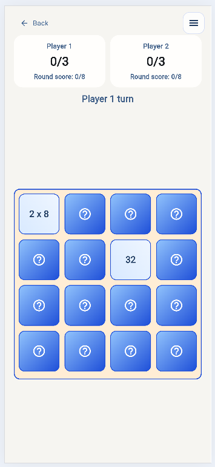 |

| Snake Game | Number Invasion |
|---|---|
| 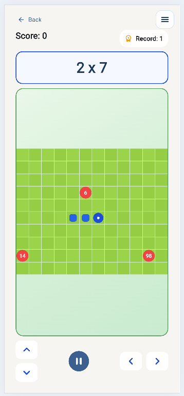 | 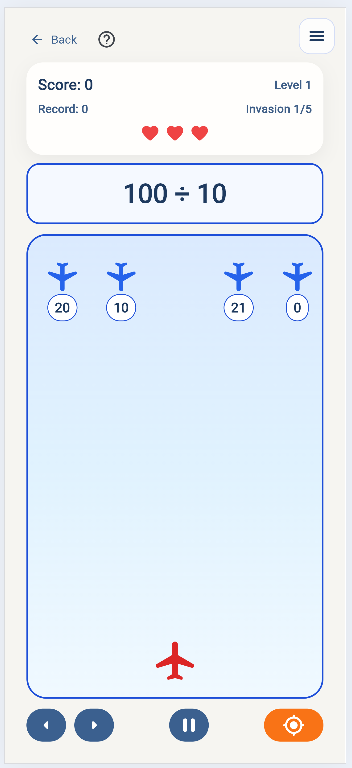 |

### Configuration

| Tic-tac-toe Settings | Settings |
|---|---|
| 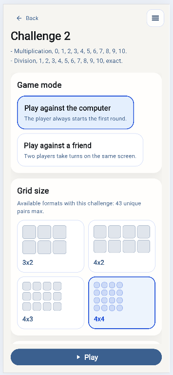 | 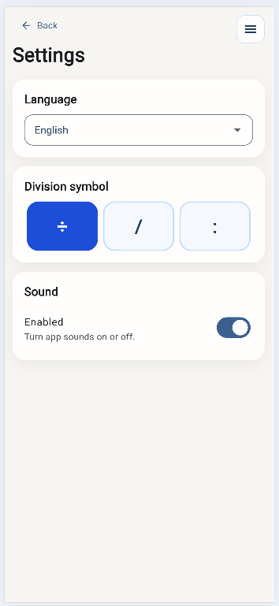 |

## Intended Public Repo Structure

For a public showcase repository without source code, a clean structure could be:

```text
MathDefy-showcase/
  README.md
  LICENSE
  docs/
    screenshots/
      home-challenges.png
      challenge-builder-empty.png
      challenge-builder-filled.png
      challenge-activities.png
      challenge-games.png
      activity-levels.png
      analytics-overview.png
      analytics-activities.png
      analytics-mistakes.png
      find-result-choice.png
      snake-game.png
      number-invasion.png
      tic-tac-toe-settings.png
      settings.png
```

## Suggested GitHub Description

**Short description**

> MathDefy is a math learning app that combines custom challenges, activities, games, and analytics to turn practice into measurable progress.

**About text**

> Public showcase repository for MathDefy. This repository presents the product, screenshots, and feature overview without exposing the private source code.

## License

This showcase content can remain under your preferred license.
If you want the showcase repository to stay noncommercial as well, you can reuse the same license approach as the private project documentation.
